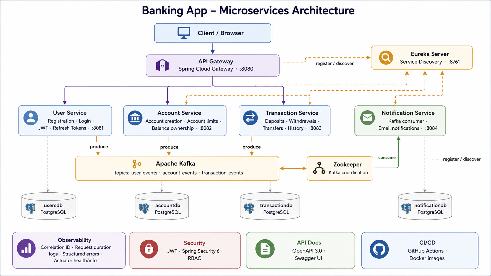

# PetrosBank Microservices

A Spring Boot banking microservices project built with Java 17, Docker, PostgreSQL, Kafka, Eureka Service Discovery, API Gateway routing, JWT authentication, refresh tokens, structured error responses, correlation ID tracing, request duration logging, and Spring Boot Actuator observability.

This project is intended as a backend engineering portfolio project focused on enterprise-style banking application patterns.

---

## Table of Contents

- [Overview](#overview)
- [Architecture](#architecture)
- [Services](#services)
- [Key Features](#key-features)
- [Tech Stack](#tech-stack)
- [Running the Project](#running-the-project)
- [Environment Variables](#environment-variables)
- [API Gateway Routes](#api-gateway-routes)
- [Authentication Flow](#authentication-flow)
- [Observability](#observability)
- [Actuator Endpoints](#actuator-endpoints)
- [Local Health Check Script](#local-health-check-script)
- [Example API Flow](#example-api-flow)
- [Project Improvements Implemented](#project-improvements-implemented)
- [Future Improvements](#future-improvements)
- [License](#license)

---

## Overview

This project demonstrates a modular banking backend using a microservices architecture.

The system includes separate services for users, accounts, transactions, notifications, service discovery, and API gateway routing. Each main business service owns its own PostgreSQL database and communicates through REST APIs and Kafka events.

The project includes practical enterprise backend features such as:

- Central API Gateway entry point
- Eureka service discovery
- JWT authentication
- Refresh token authentication flow
- Role-based endpoint protection
- Per-service PostgreSQL databases
- Kafka-based event communication
- Correlation ID propagation
- Request and response tracing logs
- Request duration logging
- Consistent structured error responses
- Spring Boot Actuator health and info metadata
- Docker Compose local infrastructure

---

## Architecture



---

## Services

| Service | Port | Responsibility |
|---|---:|---|
| API Gateway | `8080` | Central entry point and route forwarding |
| User Service | `8081` | Registration, login, JWT issuance, refresh tokens, user profiles |
| Account Service | `8082` | Account creation, account limits, account status, balance ownership |
| Transaction Service | `8083` | Deposits, withdrawals, transfers, balance lookup, transaction history |
| Notification Service | `8084` | Consumes Kafka events and prepares notification workflows |
| Eureka Server | `8761` | Service registry and discovery |
| Kafka | `9092` / internal | Event streaming |
| PostgreSQL Databases | Docker internal | Separate database per service |

---

## Key Features

### API Gateway

All external API requests can go through the API Gateway:

```text
http://localhost:8080
```

Gateway routes:

```text
/api/v1/users/**          -> user-service
/api/v1/accounts/**       -> account-service
/api/v1/transactions/**   -> transaction-service
```

### Authentication

The User Service supports:

- User registration
- Login with email and password
- JWT access token generation
- Refresh token creation
- Refresh token validation
- Logout by revoking refresh tokens

Protected endpoints require:

```http
Authorization: Bearer <access-token>
```

### Correlation ID Tracing

The system supports request tracing with:

```http
X-Correlation-ID
```

If the client does not provide a correlation ID, the API Gateway or service creates one automatically.

The same correlation ID is included in:

- Request logs
- Response headers
- Error responses
- Service logs through MDC

Example log:

```text
Gateway request completed. correlationId=petros-test-id, method=GET, path=/api/v1/users/accessAll, status=200, durationMs=23
```

### Structured Error Responses

Error responses include useful debugging metadata:

```json
{
  "errorCode": "NOT_FOUND",
  "errorMessage": "Account number does not exist: 9999999999",
  "errorDetails": "Account not found. Invalid Account.",
  "timestamp": "2026-06-29T15:46:44.018Z",
  "path": "/api/v1/transactions/balance/9999999999",
  "correlationId": "petros-transaction-duration-test"
}
```

### Request Duration Logging

Each main service logs when a request starts and when it completes.

Example:

```text
Transaction service request received. correlationId=abc-123, method=GET, path=/api/v1/transactions/balance/9999999999
Transaction service request completed. correlationId=abc-123, method=GET, path=/api/v1/transactions/balance/9999999999, status=404, durationMs=237
```

### Actuator Metadata

Each service exposes professional metadata through `/actuator/info`.

Example:

```json
{
  "app": {
    "name": "Transaction Service",
    "version": "1.0.0",
    "description": "Service that processes deposits, withdrawals, transfers, balance checks, and transaction history"
  },
  "technology": {
    "java": 17,
    "framework": "Spring Boot",
    "architecture": "Microservices"
  },
  "domain": {
    "bounded-context": "Transaction Processing",
    "main-responsibilities": "Deposits, withdrawals, transfers, balance lookup, transaction history, and account validation"
  },
  "messaging": {
    "kafka-topic": "transaction-events"
  },
  "build": {
    "artifact": "transaction-service",
    "name": "transaction-service",
    "version": "0.0.1-SNAPSHOT",
    "group": "com.backendev"
  }
}
```

---

## Tech Stack

### Backend

- Java 17
- Spring Boot
- Spring Security
- Spring Cloud Gateway
- Spring Cloud Netflix Eureka
- Spring Data JPA
- Hibernate
- Maven

### Authentication

- JWT access tokens
- Refresh tokens
- Role-based access control

### Data

- PostgreSQL
- Database-per-service pattern

### Messaging

- Apache Kafka
- Zookeeper
- Spring Kafka

### Infrastructure

- Docker
- Docker Compose
- Eureka Service Discovery
- API Gateway

### Observability

- Spring Boot Actuator
- Health endpoints
- Info metadata
- Correlation ID logging
- Request duration logging
- Structured error responses

---

## Running the Project

### Prerequisites

- Java 17+
- Docker Desktop
- Docker Compose
- Git

### Clone the repository

```bash
git clone https://github.com/PetrosTam/petrosbank-microservices.git
cd petrosbank-microservices
```

### Create `.env`

Create a `.env` file in the project root:

```env
JWT_SECRET=your-256-bit-secret
DB_USER=postgres
DB_PASS=postgres
MAIL_USERNAME=dummy@gmail.com
MAIL_PASSWORD=dummy
```

For local development, dummy mail credentials are acceptable because the notification service disables mail health checks.

### Start all services

```bash
docker compose up -d --build
```

### Check running containers

```bash
docker compose ps
```

### Stop all services

```bash
docker compose down
```

---

## Environment Variables

| Variable | Description | Example |
|---|---|---|
| `JWT_SECRET` | Secret key used for JWT signing | `your-secret-key` |
| `DB_USER` | PostgreSQL username | `postgres` |
| `DB_PASS` | PostgreSQL password | `postgres` |
| `MAIL_USERNAME` | SMTP username for notification service | `dummy@gmail.com` |
| `MAIL_PASSWORD` | SMTP password or app password | `dummy` |
| `SPRING_KAFKA_BOOTSTRAP_SERVERS` | Kafka bootstrap server | `kafka:29092` |
| `EUREKA_CLIENT_SERVICE_URL_DEFAULTZONE` | Eureka registry URL | `http://eureka-server:8761/eureka/` |

---

## API Gateway Routes

Base URL:

```text
http://localhost:8080
```

| Route | Target Service |
|---|---|
| `/api/v1/users/**` | User Service |
| `/api/v1/accounts/**` | Account Service |
| `/api/v1/transactions/**` | Transaction Service |

Example public endpoint:

```bash
curl http://localhost:8080/api/v1/users/accessAll
```

---

## Authentication Flow

### 1. Register user

```http
POST /api/v1/users/register
```

Example body:

```json
{
  "firstName": "Petros",
  "lastName": "Test",
  "email": "petros@test.com",
  "password": "Password123!",
  "phone": "99999999",
  "roles": ["ROLE_USER"]
}
```

### 2. Login

```http
POST /api/v1/users/login
```

Example body:

```json
{
  "email": "petros@test.com",
  "password": "Password123!"
}
```

Example response:

```json
{
  "accessToken": "...",
  "refreshToken": "...",
  "email": "petros@test.com",
  "roles": ["ROLE_USER"],
  "expiration": "..."
}
```

### 3. Use access token

```http
Authorization: Bearer <access-token>
```

### 4. Refresh access token

```http
POST /api/v1/users/refresh-token
```

Example body:

```json
{
  "refreshToken": "<refresh-token>"
}
```

### 5. Logout

```http
POST /api/v1/users/logout
```

Example body:

```json
{
  "refreshToken": "<refresh-token>"
}
```

---

## Observability

### Correlation ID

Send a custom correlation ID:

```powershell
$customCorrelationId = "petros-test-correlation-id"

Invoke-RestMethod `
    -Uri "http://localhost:8080/api/v1/users/accessAll" `
    -Method Get `
    -Headers @{ "X-Correlation-ID" = $customCorrelationId }
```

Check logs:

```bash
docker logs api-gateway --tail 100
docker logs user-service --tail 100
docker logs account-service --tail 100
docker logs transaction-service --tail 100
```

### Clean production-style logs

The services are configured to reduce unnecessary Spring DEBUG logs and focus on application-level request tracing.

---

## Actuator Endpoints

### API Gateway

```text
http://localhost:8080/actuator/health
http://localhost:8080/actuator/info
```

### User Service

```text
http://localhost:8081/actuator/health
http://localhost:8081/actuator/info
```

### Account Service

```text
http://localhost:8082/actuator/health
http://localhost:8082/actuator/info
```

### Transaction Service

```text
http://localhost:8083/actuator/health
http://localhost:8083/actuator/info
```

### Notification Service

```text
http://localhost:8084/actuator/health
http://localhost:8084/actuator/info
```

PowerShell pretty JSON:

```powershell
Invoke-RestMethod -Uri "http://localhost:8084/actuator/info" -Method Get | ConvertTo-Json -Depth 10
```

---

## Local Health Check Script

A PowerShell health check script is included to quickly verify that all core services are running locally.

Run from the project root:

```powershell
powershell -ExecutionPolicy Bypass -File .\scripts\health-check.ps1
```

The script checks the following services:

| Service | Health Endpoint |
|---|---|
| API Gateway | `http://localhost:8080/actuator/health` |
| User Service | `http://localhost:8081/actuator/health` |
| Account Service | `http://localhost:8082/actuator/health` |
| Transaction Service | `http://localhost:8083/actuator/health` |
| Notification Service | `http://localhost:8084/actuator/health` |
| Eureka Server | `http://localhost:8761/actuator/health` |

Example output:

```text
Banking App - Local Health Check
================================

[UP]   API Gateway
[UP]   User Service
[UP]   Account Service
[UP]   Transaction Service
[UP]   Notification Service
[UP]   Eureka Server

All services are healthy.
```

This is useful after running Docker Compose to confirm that the local microservices environment is ready.

---

## Example API Flow

A typical banking flow:

```text
1. Register user
2. Login and receive access token + refresh token
3. Create bank account
4. Deposit money
5. Withdraw money
6. Create second account
7. Transfer money between accounts
8. Fetch transaction history
9. Use correlation ID to trace logs across services
```

---

## Project Improvements Implemented

This project was extended and improved with the following backend engineering upgrades:

- Added API Gateway with Eureka-based routing
- Added refresh token authentication flow
- Added logout by refresh token revocation
- Fixed transaction history to include both incoming and outgoing transactions
- Improved account limit error handling with proper `409 CONFLICT`
- Added correlation ID propagation through API Gateway and services
- Added correlation ID to structured error responses
- Added timestamp, request path, and correlation ID to error responses
- Added request completion logging with HTTP status and duration
- Added clean production-style logging levels
- Added custom log patterns with service name and correlation ID
- Added Actuator health/info metadata for all services
- Added notification service actuator support
- Disabled mail health check for local development dummy SMTP credentials
- Added build metadata to notification service

---

## Future Improvements

Possible future improvements:

- Centralized logging with ELK or OpenSearch
- Distributed tracing with OpenTelemetry
- Metrics dashboards with Prometheus and Grafana
- More complete API documentation collection
- Integration tests for gateway-based flows
- Password reset flow
- Email verification flow
- CI/CD pipeline hardening
- Kubernetes deployment manifests
- Helm chart support
- Centralized configuration with Spring Cloud Config

---

## License

This project is licensed under the MIT License.